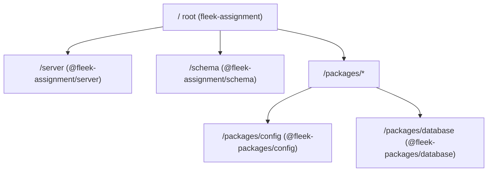

# Fleek Backend Assignment

Requires: `Node 20`, `pnpm 8`, `Docker`

  
Full assignment text

# Fleek Backend Engineer Assignment

This assignment aims to assess the backend skills for a prospective backend engineer at Fleek.  It will test the following stack: Typescript, Graphql, MySQL.  In terms of deployment, you can use any cloud provider of your choice but using a Serverless backend for the API is a requirement (AWS preferred, Lambda preferred).  You will have a day to turnaround this assignment.  The following artifacts will be expected: code of application, migration code and schema for db, deployment for application, tests and a readme. Your assignment will be assessed based on the following:
 - Correctness
 - Code quality
 - Written response
 - Testing
 - Bonus points: monitoring and performance data/analysis

Here are the specifications for the assignments, please create a Github repo to push this to when all is complete.

### Graphql API
 - Schema & deployment: Design a straightforward key-value pair database schema. Execute query and mutation API calls against this database endpoint, deploying it as a lambda function.
 - Authentication: Ensure that the lambda function is accessible only to authenticated requests.
 - Data validation: To enhance data integrity and security, implement some data validation mechanisms of your choice.

### CRUD Operations
 - CRUD operations: Develop a lambda function that conducts CRUD operations on the deployed GraphQL database. This involves sending authenticated requests to the endpoint established in the first part.
 - Authentication: Utilize JSON Web Tokens (JWT) to enforce that only authenticated requests from the caller are accepted by the lambda.
 - Batch processing: Support batch operations by allowing users to perform multiple updates or deletions in a single command, improving efficiency for managing larger datasets.
 - Error handling: Enhance error handling mechanisms to provide informative error messages and gracefully handle various scenarios, such as validation errors or unauthorized access attempts.

### Written component (README.md)
 - General: Overview of your design choices
 - Improvements: If you were to release this into production, what improvements would you make?
---

## Preview URL

https://1dthki8qwg.execute-api.eu-west-1.amazonaws.com/graphql

## Highlights

- Full type-safety, from the database up to the API, using database introspection, codegen and [kysely](https://kysely.dev/)!
- Monorepo with no build required for development, instant startup.
  Dynamic imports (made possible by [Preconstruct](https://preconstruct.tools/)) and TypeScript transpilation (done with [tsx](https://github.com/privatenumber/tsx)) on the fly!
- Database schema management with [skeema.io](https://skeema.io) - no migration files needed!
- Fully automated CDK deployment of Lambda behind API Gateway, in a VPC with an RDS MySQL database ([see the stack](/server/lib/server-stack.ts)
- No secrets stored in the repo, everything retrieved through AWS SecretsManager, but with convenient functions like `pnpm db:diff:production` exposed to developers.

## Things missing

I ended up focusing a lot more on the architecture of the monorepo, CDK and database schema, and I didn't have time to give the GraphQL API its much needed TLC. Things that are missing:

- `Auhentication` - easy enough to add, [createContext.ts](/server/src/graphql/createContext.ts) should me augmented to read the `Authorization: Bearer` token. The API Gateway CDK setup already has the necessary setup, all that's missing is adding the jwt library: https://github.com/FleekVan/fleek-assignment/blob/9acf1aa86d77426df98d47ec26fff5b499e87dae/server/lib/server-stack.ts#L119-L131
- Better data validation and error messages - There are many possible approaches to error messages. In the past, I've handled them with Apollo plugins that tansforme known error types on the fly. Here, I used `GraphQLError` directly to map `ZodError` for input validation, or to handle duplicate record database errors. Definitely room for improvement:
  https://github.com/FleekVan/fleek-assignment/blob/9acf1aa86d77426df98d47ec26fff5b499e87dae/server/src/services/StoreRecordService.ts#L25-L39
- Any observability. The choices here are varied - we could go with CloudWatch into a Kinesis stream into AthenaDB for logs, we could go with DataDog. For general performance and error monitoring, I've found Sentry to be excellent in the past, as it can provide per-field resolver performance metrics.
- Didn't have time to do delete, but it's simple enough.

## General design philosophy

I strive for end-to-end type-safety, and write the tools to make that trivial for the developer. To that end:

- Database is managed with [skeema.io](https://skeema.io). This means that we do not generate migration scripts. Instead, for any given commit in the monorepo, we have a singular definition of what the database looks like, encoded in plain `.sql` files. When we need to "migrate", we let `skeema` automatically generate the necessary DDL statements. We can put checks in place that prevent gate any destructive database operations (eg, removing a column). It's also easy to generate previews of DDL statements inside PRs, so that we know what database changes will be executed when a particular branch is merged. With the above approach, combined with some operational rules, I have implemented zero-downtime data migrations in the past using a 5 step process:
    - Part 1 - Makes any additions to the database schema in support of the code that will come later. Only add tables and columns to the database, never do unsafe changes or deletions. This does not affect existing code.
    - Part 2 - Deploy new code that augments the existing code and starts WRITING to the new fields and tables but continues to also write to the old ones. READ is still executed against the old fields. These writes can be verified in the production environment.
    - Part 3 - Manually execute migration scripts to copy any old data from old fields and tables to the new ones. At this stage all the data should be migrated and any new data created by users or processes will be written to both the old and the new structures.
    - Part 4 - Switch the READ code to READ from the new structures. We continue to WRITE to both old and new structures. This is the highest risk step.
    - Part 5 - Remove the old WRITE code. Remove all unused schema. This is low (but not zero) risk, as everything being removed is already out of use.
- We generate database types by directly introspecting our database. In the past, I've also done it by introspecting the `.sql` files managed by `skeema`. This means we have TS types that are a guaranteed match to our database definition. If the database definition changes, the types change. With [graphql-codegen](https://the-guild.dev/graphql/codegen) or [tRPC](https://trpc.io/) it's then trivial to propagate any database changes all the way into React components on the frontend, giving us true end-to-end type-safety, from a database column through any API and all the way into a React form input.

## Monorepo

We are using pnpm's monorepo functionality to manage a total of 5 packages, including the root package.

### / root (fleek-assignment)

The root package is responsible for:

- automatic code formatting on commit with husky and prettier
- cross-monorepo imports with [https://preconstruct.tools](https://preconstruct.tools) dev mode that allows us to eg import into `@fleek-assignment/server` from `@fleek-packages/database` without having to build TS to JS first.
- global scripting commands for database/schema management, elaborated on later.
  - `pnpm db:diff:production` Shows a diff between the local database schema and the production database
  - `pnpm db:pull:production` Pull the database schema definition from the production database into the repository and update the database types
  - `pnpm db:push:production` Push all local database schema changes to the production database and update the database types
- shared tooling packages used across the whole repo, like `typescript`, `preconstruct`, `turbo` and `tsx`.

### /server (@fleek-assignment/server)

The graphql backend, as well as [CDK deployment setup](/server/lib/server-stack.ts).
It uses [graphql-compose](https://graphql-compose.github.io/) to build the schema, and [zod](https://zod.dev/) for input validation and error messages.

Noteworthy workspace commands:

- `pnpm dev` - Start a debuggable dev server bound to `http://localhost:5001/` - available as a global command under `pnpm -w dev`
- `pnpm deploy:production` - Execute a CDK deployment of the graphql API behind an API Gateway, as well as deploying a RDS MySQL database, to be discussed later.

### /schema (@feek-assignment/server)

Database schema management with [skeema.io](https://skeema.io). It contains our database schema `.sql` definitions under [/schema/fleekdb](/schema/fleekdb):

Noteworthy monorepo-wide commands:

- `pnpm skeema` - [a light wrapper](/schema/skeema) around the skeema cli that pulls the database credentials from AWS SecretsManager.

### /packages/config (@fleek-packages/config)

Exposes a common [tsconfig.base.json](/packages/config/tsconfig.base.json) configuration that is used throughout the monorepo.

A few notable choices:

- The config enables additional strictness checks to get the most out of TypeScript.
- We use `"moduleResolution": "Bundler"` in combination with preconstruct-generated `package.json#exports` fields to disable deep imports. For example, you are prevented from doing something like `import { hiddenFunction } from "some-package/src/hiddenFunction"`. Only the files declared by packages as exports can be imported.

The full <code>tsconfig.base.json</code>

https://github.com/FleekVan/fleek-assignment/blob/9acf1aa86d77426df98d47ec26fff5b499e87dae/packages/config/tsconfig.base.json#L1-L32

### /packages/database (@fleek-packages/database)

This ended up being one of the largest packages in the monorepo.

- It takes care of [AWS SecretsManager database config resolution](/packages/database/src/utils/getDatabaseConfig.ts).
- It [provides a local test database](/packages/database/jest.globalSetup.ts) built with [testcontainers](https://github.com/testcontainers/testcontainers-node) that is automatically migrated to any changes in `/schema` configs.
- It provides the `@fleek-packages/database/repository` entrypoint to give us fully TypeSafe database repositories built with [kysely](https://kysely.dev/) that are used by `@fleek-assignment/server` services.
- It provides `@fleek-packages/database/test` entrypoint that allows us to use database tests in other monorepo workspaces, though I never got that far.
